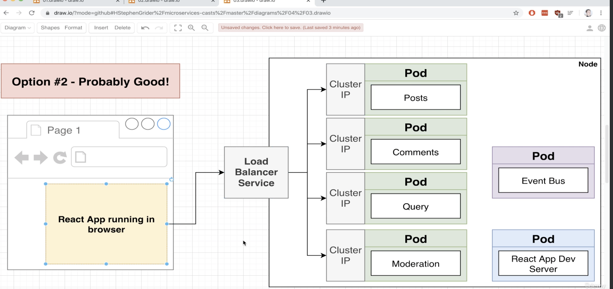
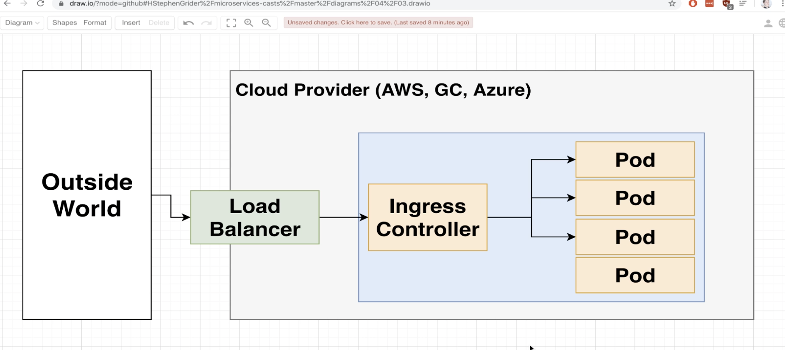

# Microservices

We will use `express` for backend. To run express we will use `nodemon index.js` (and add this to the npm script so you can just run npm start to kick up the server)

## Event Bus

Examples like RabbitMQ, Kafka, NATS.

Event Bus receives events, publishes them to listeners.

Many different subtle features that make async communication (communication through event bus) way easier, or harder.

### Sync Events

If for some reason your servives are down then you will lose the events. To to able to reply those events during the downtime, the event bus will need to store all the events.
So when the failed service is restarted, it can retrieve all the events from the event bus and process them.

## Docker

We will be running this using Docker.

Include the docker file and build it

```sh
docker build .

# then you get an id and run that id
docker run 6a069de8256a
```

Or better just give a tag

```sh
docker build . -t ms/posts

docker run ms/posts
```

Run a container but override the degault command

```sh

docker run -it ms/posts [cmd]
```

Execute a given command in a running container

```sh
docker exec -it [container id] [cmd]
# to get out use 'cmmand d'
```

Print out logs from the given container

```sh
docker logs [container id]
```

## Kubernetes

For Mac, on the Docker icon, click on "preference -> Kubernetes -> enable Kubernetes".

In the world of Kubernetes:

- Kubernetes Cluster: a collections of nodes + a master to manage them.
- Node: a virtual machine.
- Pod: more or less same as containers. A pod can have multiple containers
- Deployment: in charge of managing the pods. E.g., If a pod dies it will recreate the pod.
- Service: it handles access/networking for pods to be reached out running inside the kubernetes.

The config file looks like this:

```yml
apiVersion: v1
kind: Pod
metadata:
  name: posts
spec:
  containers:
    - name: posts
      image: ms/posts:latest
```

Apply the config code:

```bash

kubectl apply -f posts.yaml
```

To see the running pods

```sh
kubectl get pods
```

To delete all pods from a given k8s folder

```sh
kubectl delete -f infra/k8s/
```

If your pods are showing ErrImagePull, ErrImageNeverPull, or ImagePullBackOff errors after running kubectl apply, the simplest solution is to provide an imagePullPolicy to the pod.

First, run kubectl delete -f infra/k8s/

Then, update your pod manifest:

```yml
spec:
  containers:
    - name: posts
      image: cygnet/posts:0.0.1
      imagePullPolicy: Never
```

Then, run kubectl apply -f infra/k8s/

### Common kubectl commends

- kubectl get pods
- kubectl exec -it [pod_name] [cmd]
- kubectl logs [pod_name]
- kubectl delete pod [pod_name]
- kubectl apply -f [config_file]
- kubectl describe pod [pod_name] # mostly for debuging

### Deployment Object

In practice, we don't create Pods directly, instead, we create Deployment object to manage sets of Pods.

Looks like this

```yml
piVersion: apps/v1
kind: Deployment
metadata:
  name: posts-depl
spec:
  replicas: 1
  selector:
    matchLabels: # just key value pair to match a lable
      app: posts
  template:
    metadata:
      labels:
        app: posts # this works together with the metadata
    spec:
      containers:
        - name: posts
          image: ms/posts:latest
          imagePullPolicy: Never
```

To apply it:

```sh

kubectl apply -f posts-depl.yaml

```

To get deployments

```sh
kubectl get deployments

```

To delete deployment

```sh

kubectl delete deployment [deployment_name]
```

Note that the deployment will create pods for you. If you manually delete any pod, it's going to create another one for you automatically. This is the magic of Deployment object - it deploys the pods when necessary for you!!

To always apply the latest version, use the latest tag.
Here are the steps every time when we change the code we need to rebuild the images and restart the deployment.

- Make update to the code
- build the image
  - docker build -t acct/project:latest .
- push the image to docker hub
  - use `docker push [tag_name]
- run this command
  - kubectl rollout restart deployment [depl_name]

```sh
kubectl rollout restart deployment [deployment_name]
```

### Services object

Services are responsible for network between pods.
Types of services:

- Cluster IP: sets up a URL to access pod so the pods can communicate with each other through it. Only expose pods in the cluster/within the node.
- Node Port: makes a pod accessible from outside the cluster - mostly for dev only. Basically like a loadbalancer. It will have a randomly assigned port (like 30XXX) for you to send request to.
- Load Balancer: makes a pod accessible from outside the cluste - the right way to do.
- External Name: redirecs an in-cluster reauest to a CNAME url.

#### Example of Node Port service (just for dev purpose):

```sh

kubectl apply -f post-srv.yaml
```

Then to get the port you need to use to access the service,

```sh
kubectl describe services posts-srv
```

You can then find the randomly assign port 30xxx/TCP and that's what we need to use to access the pod.

For Docker for Mac/Windows,now you will use `localhost:30xxx/posts` to access the pod. You can just try it using your browser.

#### Cluster IP Service

For pods to communicate between each other we will create Cluster IP services. This allows you to use the name of the service (like, "event-bus-srv") as DNS rather than using the IP address.

Refer to `event-bus-depl.yaml`. After you apply this file and have the Service up and running, you will make a request to the url like `http://event-bus-srv:4005` to reach out to the service.

#### Load Balancer Service

To allow access from outside (i.e., the browser) we will create a load balancer service.

This is the overall diagram:


The Load Balancer tells K8s to reach out to its cloud provider (e.g., AWS) and provision a loadbalancer and gets traffic into "a single" pod.

The Load Balancer alone is not going to know which pod it should route the traffic to...that's where the `Ingress/Ingress` Controller comes in to play.

#### Ingress

Ingress is a pod with a set of routing rules to distribute traffic to other pods (or more acurately, Cluster Ip Services).



##### Install Ingress Nginx Controller

Installation
Based on the Kubernates documentation:

```sh
kubectl apply -f https://raw.githubusercontent.com/kubernetes/ingress-nginx/controller-v1.10.1/deploy/static/provider/cloud/deploy.yaml
```

Then we will create the config file `ingress-srv-depl.yaml` for ingress.
The ingress does not allow you to specify the method like get, post..so you need to make sure all the endpoints have an unique name.

#### Skaffold

Use skaffold for development in K8s should make your live easier when you need to update code in a running pod.
It automates the tasks to create/delete all objects tied to a project at once.

```sh

brew install skaffold
```

Add the `skaffold.yaml` config file.

Run skaffold by using `skaffold dev`.

The first time when you run the command it will take longer as it will re-create all the images.

Now after the first start when you run `skaffold dev` it should kick off the pods. Now every time you make changes to the code it will restart the your pod to reflect the changes.
